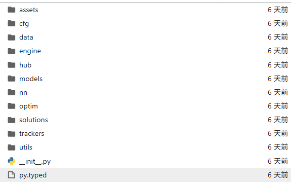

# 一、YOLO目标检测数据采集，清理，划分，检查工具包
- data_collection: ROS2机器人数据采集（主要是RGB和RGBD数据，以及过滤掉损坏图片的工具）
- format_conversion: 数据转换工具，数据标注结合labelme（内含SAM3分割大模型可以辅助标注数据，标注完后通过mask转txt可以快速生成标签）
- train_tricks:后续提升模型的泛化性和提升单个模型的检测数量的数据处理工具
- Dataset_tools:数据集处理工具，包括标签图像匹配，批量修改类别id，划分数据集，数据统计，模糊图像去除，去重等
- label_tools: 数据标注工具

# 二、模型训练（ultralytics文档说明，模型训练以及机器人目标检测训练技巧，相关参数）
## ultralytics文档说明
### 1.安装及 ultralytics说明
```bash
# bash（安装的包一般是在：miniconda3/lib/python3.8/site-packages/ultralytics）
pip install ultralytics
```

<div align="center">
  
  <br>
  <em>图1: ultralytics目录</em>
</div>

### 2.模型的配置文件
```txt
模型的配置文件在ultralytics/cfg/models目录下（yolo3，5，6，8，9，10，11，12，26）

```

<div align="center">
  
  <br>
  <em>图2: yolo11的结构图</em>
</div>
对比可以很清楚的看到各个模型之间结构的差异，其中yolo11_Adown.yaml为修改结构的目标检测文件，best.pt为其训练的最佳模型权重文件


### 3.模型的训练参考
```txt
官方的模型的配置文件在ultralytics/cfg/models目录下（yolo3，5，6，8，9，10，11，12，26）
模型训练微调量化和转出推理预测参考模型训练微调量化和转出推理预测.ipynb
其中类别的文件为data.yaml,训练配置文件为arg.yaml(各个参数的详细说明在arg.yaml做了说明)
```
### 4.模型的训练技巧
- 超参数配置：warmup_epochs: 0    # 预热轮数（学习率从低到高线性增长及训练开始由0-初始学习率线性增加），好处是模型前期快速拟合，一般设置为总训练轮数的10%左右比较合。
- 
